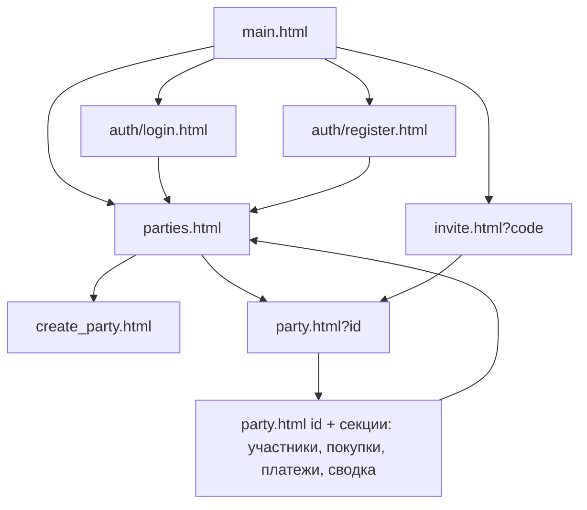
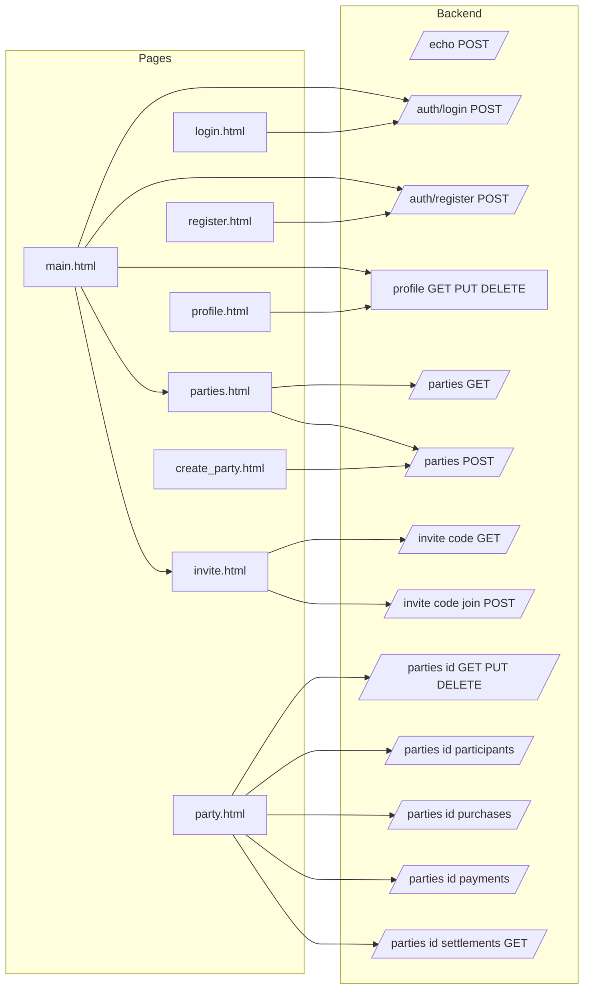

# План страниц фронтенда (Skid)

Простой набор HTML-страниц без CSS, с минимальным JS (`fetch` + `js/config.js`) для связи с бэкендом через cookie-авторизацию (`credentials: 'include'`, cookie `token`).

## Общие правила для всех страниц

- Подключение: `` (из корня `Frontend/`). Из вложенных папок — `../js/config.js`.
- Все запросы к API через `AppConfig.getEndpoint(path)`.
- Все запросы с `credentials: 'include'` (важно — бэкенд отдаёт `Set-Cookie: token`; [`auth_m.go`](../../Backend/internal/middleware/auth_m.go:98) `SetGuestCookie`).
- Ответ бэкенда всегда обёрнут: `{ "message": ..., "data": ..., "token": ... }` — см. [`handler.go`](../../Backend/internal/handlers/handler.go:40). Ошибки: `{ "error": ... }`.
- Токен создаётся автоматически для анонима при первом запросе через middleware [`AuthMiddleware`](../../Backend/internal/middleware/auth_m.go:27). Логин/регистрация перезаписывают cookie на «настоящего» пользователя.

## Список страниц и их назначение

### 1. `Frontend/main.html` — точка входа / дашборд
**Заменяет текущий echo-тест.** Переработать в главную страницу.

- Ссылки-навигация: профиль, мои тусовки.
- Кнопка «Войти / Зарегистрироваться» (ведёт на `auth/login.html`, `auth/register.html`).
- Поле «Введите invite-код» + переход на `invite.html?code=XXX`.
- Проверка авторизации: `GET /profile` — если 401/нет данных, показать анонимный режим; если пришёл `email` — пользователь залогинен.

### 2. `Frontend/auth/login.html` — вход (уже есть)
- POST `/auth/login` → успех = `Set-Cookie`. Не трогать, кроме мелких доработок (перенаправление на `parties.html`).

### 3. `Frontend/auth/register.html` — регистрация (уже есть)
- POST `/auth/register`. Уже есть, оставить.

### 4. `Frontend/profile.html` — профиль (уже есть)
- GET / PUT / DELETE `/profile`. Уже есть. Только исправить баг: в `deleteProfile()` используется `API_BASE` вместо `AppConfig.getEndpoint` ([`profile.html`](../../Frontend/profile.html:124)) — заменить на `AppConfig.getEndpoint('/profile')`.

### 5. `Frontend/parties.html` — список моих тусовок (новый)
**Endpoint:** `GET /parties`

- Загружает список тусовок пользователя (в т.ч. анонимного).
- Для каждой: название, описание, invite-код, статус «активна/закрыта».
- Ссылка на `party.html?id={partyID}`.
- Кнопка «Создать тусовку» → `create_party.html` (доступно только зарегистрированным; анониму показывать сообщение).
- Каждая строка показывает invite-код (копируемый) — по нему приглашают других через `invite.html?code=...`.

### 6. `Frontend/create_party.html` — создание тусовки (уже есть)
- POST `/parties`. Уже есть. Оставить.

### 7. `Frontend/invite.html` — предпросмотр и вступление по приглашению (новый)
**Endpoint'ы:**
- `GET /invite/{inviteCode}` — предпросмотр: название тусовки и список placeholder-участников (которые ждут реальных людей).
- `POST /invite/{inviteCode}/join` — вступление.

**Логика:**
- Invite-код берётся из query-параметра `?code=`.
- Показывает название тусовки.
- Если есть placeholders — список радиокнопок «Занять место XXX» (необязательно, можно вступить новым участником).
- Кнопка «Присоединиться» → POST. При выборе placeholder — передать `{ placeholderID }` в теле.
- После успеха — переход на `party.html?id={partyID}`.

### 8. `Frontend/party.html` — страница тусовки (новый, самый насыщенный)
**ID тусовки из query-параметра `?id=`.**

**Endpoint'ы (GET):**
- `GET /parties/{partyID}` — информация о тусовке.
- `GET /parties/{partyID}/participants` — участники.
- `GET /parties/{partyID}/purchases` — покупки.
- `GET /parties/{partyID}/payments` — платежи.
- `GET /parties/{partyID}/settlements` — сводка/расчёт (балансы + рекомендуемые переводы).

**Endpoint'ы (создание):**
- `POST /parties/{partyID}/purchases` — новая покупка (форма: название, описание, цена, `splitType`, `debtors` — список id участников).
- `POST /parties/{partyID}/participants` — добавить placeholder-участника (имя) — только админ/владелец.
- `POST /parties/{partyID}/payments` — создать платёж (кому `toParticipantID`, сумма, комментарий).
- `POST /parties/{partyID}/payments/{paymentID}/confirm` — подтвердить получение платежа (кнопка «Подтвердить» у платежей, адресованных мне).

**Endpoint'ы (изменение/удаление покупки):**
- `PUT /parties/{partyID}/purchases/{purchaseID}` — редактирование покупки.
- `DELETE /parties/{partyID}/purchases/{purchaseID}` — удаление покупки.
- `DELETE /parties/{partyID}/participants/{participantID}` — удаление участника (админ/владелец).

**Структура страницы (простые секции):**
1. Шапка: название тусовки, описание, invite-код.
2. Участники: список; форма добавления placeholder.
3. Покупки: список (имя, покупатель, цена, тип разбивки); форма создания; кнопки «Редактировать»/«Удалить» на каждой.
4. Платежи: список (от→кому, сумма, статус «подтверждён/нет»); кнопка «Подтвердить» если адресован мне; форма создания платежа.
5. Сводка: таблица балансов участников + список рекомендуемых переводов.

**Примечание о `splitType`** ([`purchase_h.go`](../../Backend/internal/handlers/purchase_h.go:19)):
- `0` — поровну всем,
- `1` — поровну выбранным (выбрать в `debtors`),
- `2` — индивидуальные суммы,
- `3` — индивидуальные доли.
Форма покупки должна позволять выбрать тип и, при необходимости, отметить должников.

## Mermaid-схема навигации

## Mermaid-схема связей страниц и бэкенд-маршрутов

## Итого новых/дорабатываемых файлов

| Файл | Тип | Статус |
|------|-----|--------|
| `Frontend/main.html` | доработать | заменить echo-тест на дашборд |
| `Frontend/parties.html` | новый | список тусовок |
| `Frontend/invite.html` | новый | предпросмотр + вступление |
| `Frontend/party.html` | новый | управление тусовкой |
| `Frontend/profile.html` | правка бага | `API_BASE` → `AppConfig.getEndpoint` |
| `Frontend/auth/login.html` | без изменений | — |
| `Frontend/auth/register.html` | без изменений | — |
| `Frontend/create_party.html` | без изменений | — |

## Порядок реализации

1. Исправить баг в `profile.html`.
2. Создать `parties.html`.
3. Создать `invite.html`.
4. Создать `party.html` (самый объёмный).
5. Переработать `main.html` в дашборд с навигацией.